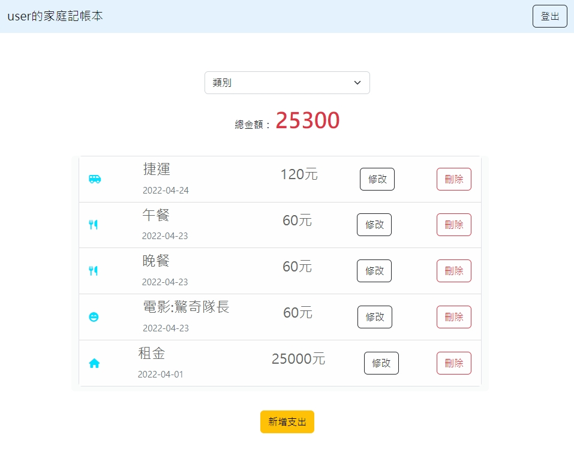

# Expense Tracker 家庭記帳本

An online expense tracker which users can record their personal expenses by account register.

##########################################################################

IF YOU LIKE THIS WEBSITE, PLEASE DONATE MY BY PAYPAL: ankewang26@gmail.com

##########################################################################

## Features
- View itemized expenses.
- View total amount.
- Classify by different category.
- Create new expense.
- Correct expense data.
- Delete expense.
- Create own account.
- Login by email and view personal expenses.
- Passwords are encrypted.

## Screen

## Getting started
1. Clone the project to your localhost.
   
   `git clone https://github.com/weizi0328/ac_expense-tracker.git`
2. Go to the folder through your terminal and install npm (node package manager)
   
   `npm install`
   
3. Refer to file ".env.example" and set environment variables.

4. Seed the database
   
   `npm run seed`

5. Run the project
   
   `npm run start`

6. If you see the following line, the project is running. Open your browser and go to the following URL:

   `Express is running on http://localhost:3000`
   `mongodb connected!`

7. Stop running the project:
   
   `ctrl + c`

## Seeder intro
- 5 records with 5 standard categories
- Default login email: `user@example.com`
- Default login password: `12345678`

## Development tools
- @popperjs/core @ 2.11.6
- cryptjs @ 2.4.3
- body-parser @ 1.20.0
- connect-flash @ 0.1.1
- dotenv @ 16.0.2
- express @ 4.18.1
- express-handlebars @ 4.0.6
- express-session @ 1.17.3
- method-override @ 3.0.0
- mongoose @ 5.13.14
- passport @ 0.4.1
- passport-local @ 1.0.0